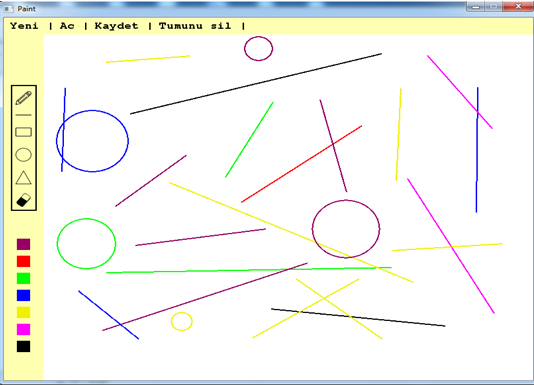

### Basic Paint
Uygulama, herkes tarafından kullanılan ve bilinen paint programının sadeleştirilmiş, basit bir halidir. 
Uygulamada serbest kalem çizimi, kare, üçgen, daire gibi temel geometrik şekil çizimleri yapılabilmektedir.
Bunula birlikte farklı renk seçeneklerinin seçilebileceği bir renk paleti de uygulama içerisinde yer almaktadır. Uygulama içerisinde yapılan çalışmalar
kaydedilerek sonrasında tekrar açılabilmektedir. Uygulama, C programlama dili ile geliştirilmiştir. Uygulamanın büyük bir kısmını oluşturan grafik işlemleri için ise “Allegro 5” kütüphanesi eklentisi kullanılmıştır.

